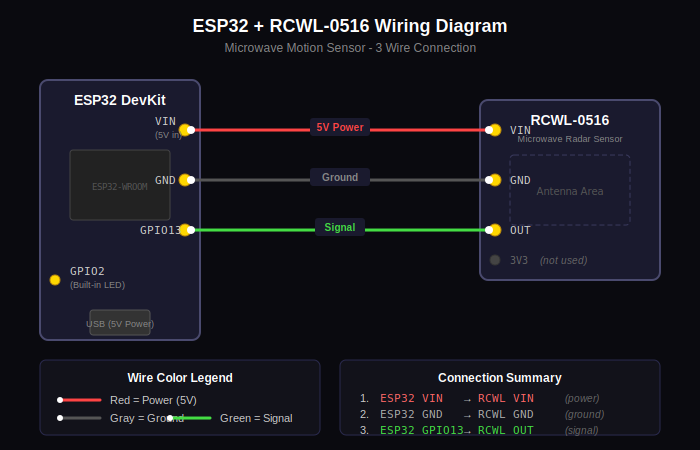

# Wiring Guide

## Visual Diagram



## ASCII Connection Diagram

```
                    ESP32 DevKit
                   +------------+
                   |            |
              3V3 -|o          o|- VIN (5V) ----+
              GND -|o          o|- GND ----+    |
               15 -|o          o|- 13 -----|----|---> RCWL-0516 OUT
                2 -|o  (USB)   o|- 12      |    |
                4 -|o          o|- 14      |    |
               16 -|o          o|- 27      |    |
               17 -|o          o|- 26      |    |
                5 -|o          o|- 25      |    |
               18 -|o          o|- 33      |    |
               19 -|o          o|- 32      |    |
               21 -|o          o|- 35      |    |
                3 -|o          o|- 34      |    |
                1 -|o          o|- VN      |    |
               22 -|o          o|- VP      |    |
               23 -|o          o|- EN      |    |
                   +------------+          |    |
                                           |    |
                                           |    |
                    RCWL-0516              |    |
                   +----------+            |    |
                   |          |            |    |
              VIN -|o        o|- OUT ------+    |
                   |          |                 |
              GND -|o        o|- 3V3 (NC)       |
                   |          |                 |
                   +----------+                 |
                        |                       |
                        +-----------------------+
```

## Pin Connections

| RCWL-0516 Pin | ESP32 Pin | Description |
|---------------|-----------|-------------|
| VIN | VIN (5V) | Power input (5V from USB) |
| GND | GND | Ground |
| OUT | GPIO 13 | Motion detection output |
| 3V3 | Not connected | 3.3V output (unused) |

## Connection Details

### Power (VIN)
- Connect RCWL-0516 VIN to ESP32 VIN pin
- VIN provides 5V directly from USB power
- RCWL-0516 works with 4-28V input

### Ground (GND)
- Connect RCWL-0516 GND to any ESP32 GND pin
- Multiple GND pins are available on ESP32

### Signal (OUT)
- Connect RCWL-0516 OUT to ESP32 GPIO 13
- Output is HIGH (3.3V) when motion is detected
- Output is LOW (0V) when no motion
- GPIO 13 has internal pull-down in the firmware

## Important Notes

### Power Considerations
- USB power is sufficient for both ESP32 and RCWL-0516
- For permanent installation, use a quality 5V USB power supply
- Minimum 500mA recommended

### Placement Tips
- Keep RCWL-0516 away from metal objects
- Radar can detect through plastic enclosures
- Mount sensor facing the detection area
- Keep away from WiFi antenna area of ESP32

### Interference
- Fluorescent lights may cause false triggers
- Motors and switching power supplies can cause interference
- If experiencing false positives, try:
  - Moving sensor away from interference sources
  - Adding shielding around sensor
  - Adjusting filter threshold in software

## Built-in LED

The ESP32's built-in LED (GPIO 2) indicates motion status:
- **LED OFF**: No motion / Idle
- **LED ON**: Motion detected / Alarm active

## Alternative GPIO Pins

If GPIO 13 is not available, you can use other GPIO pins:

**Recommended alternatives:**
- GPIO 14, 27, 26, 25, 33, 32

**Avoid these pins:**
- GPIO 0, 2, 12, 15 (boot configuration)
- GPIO 6-11 (flash memory)
- GPIO 34, 35, 36, 39 (input only)

To change the pin, modify `SENSOR_PIN` in the source code:
```cpp
#define SENSOR_PIN 13  // Change to your pin
```
